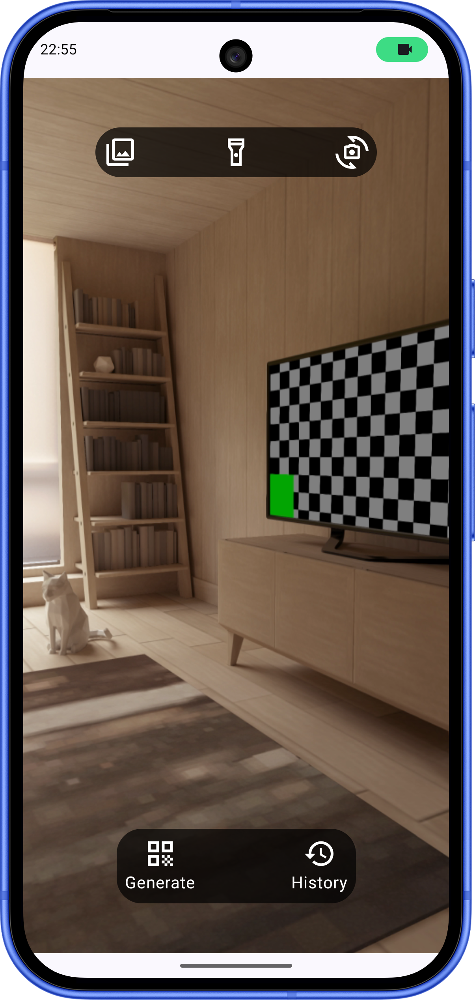
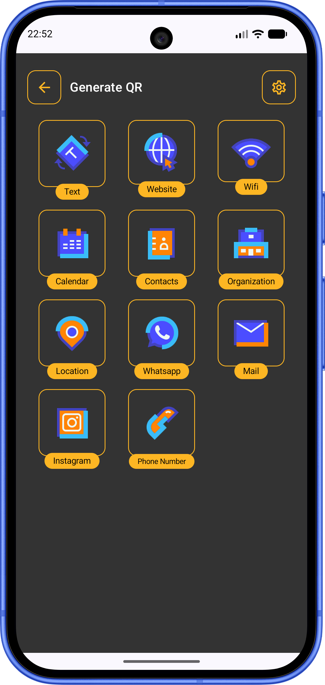
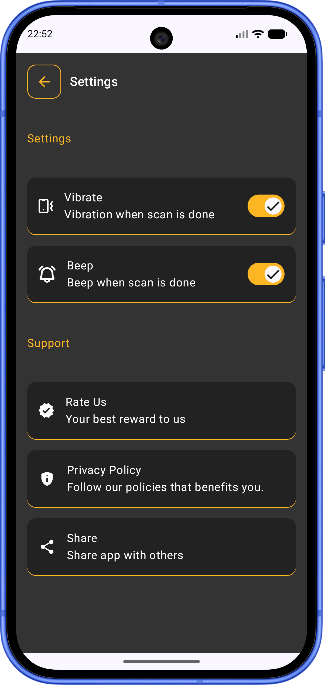

# QR Scanner

A modern Android QR code scanner and generator built with Jetpack Compose.

<p align="center">
  
  
  
</p>

---

## Features

- **Scan** — Real-time QR code scanning via camera with zoom, flash, and front/back lens controls
- **Gallery scan** — Pick an image from your gallery and detect QR codes in it
- **Generate** — Create QR codes across 11 categories:
  - Text, Website, WiFi, Calendar, Contacts, Organization, Location, WhatsApp, Mail, Instagram, Phone
- **History** — Browse and delete all scanned and generated QR codes
- **Settings** — Toggle vibration and beep feedback on scan; share the app or open the privacy policy

---

## Tech Stack

| Layer | Libraries |
|---|---|
| UI | Jetpack Compose, Material 3, Haze |
| Navigation | Navigation Compose |
| DI | Hilt |
| Camera | CameraX (camera2, lifecycle, view, extensions) |
| QR Scanning | ML Kit Barcode Scanning |
| QR Generation | QRSmith |
| Database | Room |
| Preferences | DataStore |
| Async | Kotlin Coroutines + Flow |
| Logging | Timber |

---

## Requirements

- **Min SDK:** 29 (Android 10)
- **Target SDK:** 36
- **Language:** Kotlin
- **Build system:** Gradle with Version Catalogs

---

## Getting Started

1. Clone the repository
   ```bash
   git clone https://github.com/AAyar94/QRScanner.git
   ```
2. Open the project in Android Studio Meerkat or newer
3. Build and run on a device or emulator running Android 10+

---

## Project Structure

```
app/src/main/java/com/aayar94/qrscanner/
├── core/           # Application class, DI module, navigation, theme, shared components
├── data/           # Room database, DAO, DataStore, repository
├── domain/         # Models, use cases, data source interfaces
└── presentation/   # Screens and ViewModels (MVVM + MVI contract pattern)
    ├── home/
    ├── generate/
    ├── generate_by_category/
    ├── generated_qr_detail/
    ├── history/
    ├── qr_detail/
    ├── settings/
    └── onboarding/
```

---

## CI / CD

Every pull request merged into `main` triggers a GitHub Actions workflow that:

1. Builds a debug APK
2. Creates a Git tag (`v{versionName}-{versionCode}+{shortSha}`)
3. Publishes a GitHub Release with the APK attached

See [`.github/workflows/release.yml`](.github/workflows/release.yml).

---

## Version

**1.0.0** — version code 1
